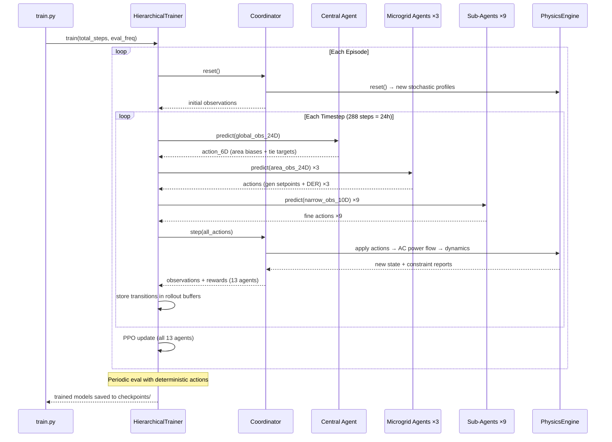
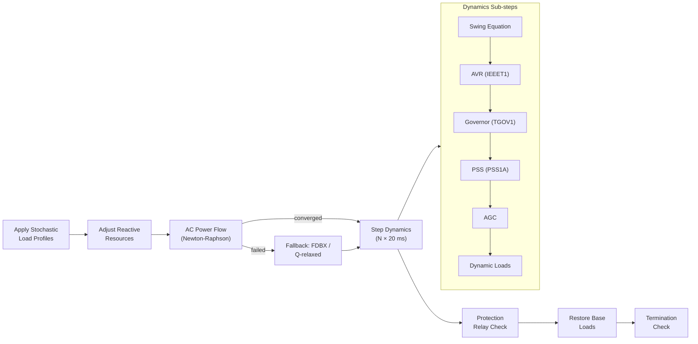
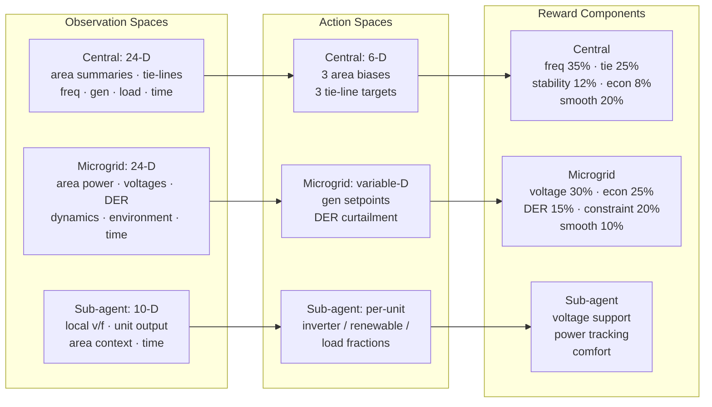
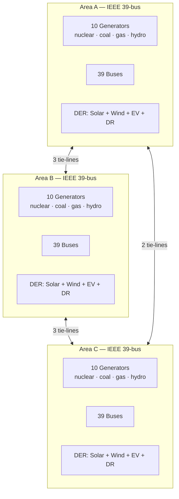
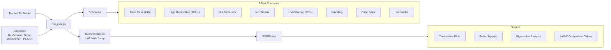

# DEMS — RL Implementation & System Simulation Flowchart

## Full Architecture

```mermaid
flowchart TB
    %% ── Entry ──
    TRAIN["🚀 train.py<br/>(Entry Point)"]
    CONFIG["⚙️ TrainingConfig<br/>steps · lr · batch · device"]

    TRAIN --> CONFIG
    TRAIN --> HT

    %% ── Hierarchical Trainer ──
    subgraph TRAINER["Hierarchical Trainer  (CTDE)"]
        HT["HierarchicalTrainer<br/>.train() loop"]
        HT -->|reset / step| COORD
    end

    %% ── Coordinator ──
    subgraph COORDINATOR["Multi-Agent Step Coordinator"]
        COORD["MultiAgentStepCoordinator<br/>orchestrates hierarchy each timestep"]
        COORD -->|"1 · global obs (24-D)"| CENTRAL
        COORD -->|"2 · area obs (24-D ×3)"| MG
        COORD -->|"3 · narrow obs (10-D ×9)"| SUBS
        COORD -->|"4 · combined actions"| PHYSICS
        COORD -->|"5 · collect rewards"| HT
    end

    %% ── Central Agent ──
    subgraph CENTRAL_BOX["Central Coordination Layer"]
        CENTRAL["CentralCoordEnv<br/>1 × PPO Agent  ‹256,256›"]
        COBS["Obs 24-D<br/>3 area summaries · 6 tie-lines<br/>sys freq · gen · load · losses · time"]
        CACT["Action 6-D<br/>area_A/B/C bias · tie_AB/BC/AC targets<br/>(±200 MW)"]
        CREWARD["CentralReward<br/>freq 35% · tie-line 25%<br/>stability 12% · economy 8%<br/>smoothness 20%"]
        CENTRAL --- COBS
        CENTRAL --- CACT
        CENTRAL --- CREWARD
    end

    %% ── Microgrid Agents ──
    subgraph MG_BOX["Microgrid Agent Layer  (×3 areas: A · B · C)"]
        MG["MicrogridEnv<br/>3 × PPO Agent  ‹256,256›"]
        MOBS["Obs 24-D per area<br/>power · voltages · DER<br/>dynamics · environment · time"]
        MACT["Action (variable-D)<br/>gen setpoints · solar/wind curtail<br/>EV util · DR curtail"]
        MREWARD["MicrogridReward<br/>voltage 30% · economy 25%<br/>DER util 15% · constraints 20%<br/>smoothness 10%"]
        MG --- MOBS
        MG --- MACT
        MG --- MREWARD
    end

    %% ── Sub-Agents ──
    subgraph SUB_BOX["Sub-Agent Layer  (×9 total — 3 per area)"]
        SUBS["Sub-Envs<br/>9 × PPO Agent  ‹128,128›"]

        INV["InverterSubEnv ×3<br/>per-gen fractional setpoints"]
        REN["RenewableSubEnv ×3<br/>solar/wind curtailment fractions"]
        LOAD["LoadSubEnv ×3<br/>EV utilisation + DR curtailment"]

        SUBS --> INV
        SUBS --> REN
        SUBS --> LOAD
    end

    %% ── Physics Engine ──
    subgraph PHYSICS_BOX["Physics Engine  (Shared Simulation)"]
        PHYSICS["PhysicsEngine.step()"]

        PROFILES["StochasticProfileGenerator<br/>random solar · wind · load per episode"]
        GRID["SuperGrid  (117-Bus)<br/>3 × IEEE 39-bus merged<br/>30 generators · 138+ lines<br/>8 tie-lines (mesh)"]
        PF["PowerFlowRunner<br/>Newton-Raphson AC<br/>FDBX / Q-relaxed fallback"]
        DYN["DynamicsCoordinator<br/>N substeps × 20 ms = 5 s per step"]
        DER["DERManager"]
        ECON["EconomicsEngine<br/>quadratic cost curves · TOU pricing<br/>carbon rates · merit-order"]
        PROT["ProtectionRelay<br/>UFLS 3-stage · OFGT · Voltage trip"]

        PHYSICS --> PROFILES
        PHYSICS --> GRID
        PHYSICS --> PF
        PHYSICS --> DYN
        PHYSICS --> DER
        PHYSICS --> ECON
        PHYSICS --> PROT
    end

    %% ── DER Fleet ──
    subgraph DER_BOX["DER Fleet  (per area)"]
        SOLAR["☀️ Solar PV<br/>~205 MW<br/>irradiance-based"]
        WIND["💨 Wind Turbines<br/>~250 MW<br/>IEC 61400 cubic curve"]
        EV["🔌 EV Charging<br/>~15 MW  (200 chargers)<br/>smart charging"]
        DR["📉 Demand Response<br/>~36.5 MW curtailable<br/>incentive-based"]

        DER --> SOLAR
        DER --> WIND
        DER --> EV
        DER --> DR
    end

    %% ── Dynamics Models ──
    subgraph DYN_BOX["Electromechanical Dynamics  (30 generators)"]
        SWING["Swing Equation<br/>symplectic Euler"]
        AVR["Excitation / AVR<br/>IEEE IEEET1 + OEL"]
        GOV["Governor-Turbine<br/>TGOV1 + valve limits"]
        PSS["PSS1A<br/>washout + lead-lag"]
        AGC["AGC<br/>ACE-based PI + deadband"]
        DLOAD["Dynamic Load Model<br/>ZIP freq/voltage dependent"]

        DYN --> SWING
        DYN --> AVR
        DYN --> GOV
        DYN --> PSS
        DYN --> AGC
        DYN --> DLOAD
    end

    %% ── Constraints ──
    CONSTRAINTS["GridConstraintValidator<br/>IEGC freq 49.5–50.5 Hz<br/>IEEE volt 0.95–1.05 pu<br/>thermal limits · gen ramps"]
    PHYSICS --> CONSTRAINTS
    CONSTRAINTS -->|ConstraintReport| MREWARD
    CONSTRAINTS -->|ConstraintReport| CREWARD

    %% ── Evaluation Branch ──
    subgraph EVAL_BOX["Evaluation Pipeline"]
        EVAL["run_eval.py<br/>N episodes × K scenarios"]
        BASELINES["Baselines<br/>No-Control · Droop (R=5%)<br/>Merit-Order · PI-AGC"]
        SCENARIOS["Scenarios<br/>Base · High Renewable · N-1 Gen<br/>N-1 Tie · Load Ramp · Island<br/>Price Spike · Low Inertia"]
        METRICS["MetricsCollector<br/>~40 fields per timestep"]
        PLOTS["IEEEPlotter<br/>Bode · Nyquist · Eigenvalue<br/>time-series · LaTeX tables"]

        EVAL --> BASELINES
        EVAL --> SCENARIOS
        EVAL --> METRICS
        METRICS --> PLOTS
    end

    HT -->|"trained model"| EVAL

    %% ── Monitoring ──
    subgraph MON_BOX["Monitoring Stack"]
        PROM["Prometheus<br/>port 9090"]
        GRAF["Grafana Dashboards<br/>Real-Time Sim · RL Optimized"]
        SIM_GEN["demo_metrics.py<br/>port 9091  (dems_*)"]
        RL_GEN["dummy_metrics_generator.py<br/>port 9092  (rl_*)"]

        SIM_GEN --> PROM
        RL_GEN --> PROM
        PROM --> GRAF
    end

    PHYSICS -.->|"live metrics"| SIM_GEN
    EVAL -.->|"RL metrics"| RL_GEN

    %% ── Styling ──
    classDef entry fill:#2196F3,color:#fff,stroke:#1565C0
    classDef trainer fill:#9C27B0,color:#fff,stroke:#6A1B9A
    classDef central fill:#FF9800,color:#fff,stroke:#E65100
    classDef mg fill:#4CAF50,color:#fff,stroke:#2E7D32
    classDef sub fill:#00BCD4,color:#fff,stroke:#00838F
    classDef physics fill:#F44336,color:#fff,stroke:#C62828
    classDef der fill:#8BC34A,color:#000,stroke:#558B2F
    classDef dyn fill:#FF5722,color:#fff,stroke:#BF360C
    classDef eval fill:#607D8B,color:#fff,stroke:#37474F
    classDef mon fill:#795548,color:#fff,stroke:#4E342E
    classDef constraint fill:#E91E63,color:#fff,stroke:#880E4F

    class TRAIN,CONFIG entry
    class HT trainer
    class CENTRAL,COBS,CACT,CREWARD central
    class MG,MOBS,MACT,MREWARD mg
    class SUBS,INV,REN,LOAD sub
    class PHYSICS,PROFILES,GRID,PF physics
    class DER,SOLAR,WIND,EV,DR der
    class DYN,SWING,AVR,GOV,PSS,AGC,DLOAD dyn
    class ECON,PROT physics
    class EVAL,BASELINES,SCENARIOS,METRICS,PLOTS eval
    class PROM,GRAF,SIM_GEN,RL_GEN mon
    class CONSTRAINTS constraint
```

---

## Training Step Sequence

---

## Physics Engine Per-Step Pipeline

---

## Observation & Action Summary

---

## Grid Topology

---

## Evaluation Pipeline

